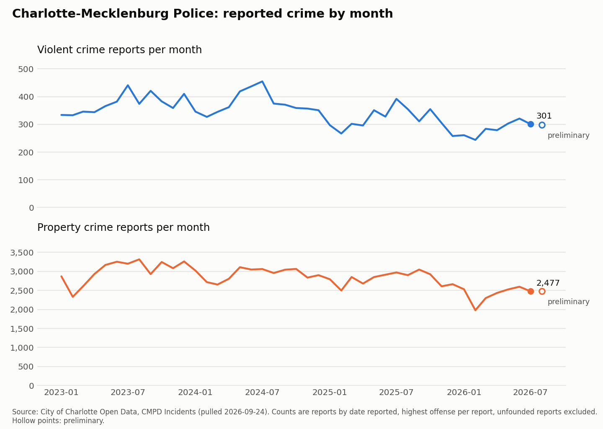
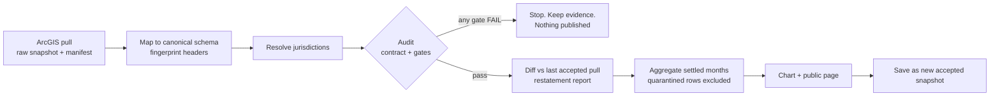

# NC Crime Data Pipeline

A monthly pipeline that turns Charlotte-Mecklenburg Police open data into a
public trend chart that a journalist can cite. It audits every run, so bad
data is caught and explained before it is published.

**[▶ View the live page](https://amachirin102.github.io/NC-Crime-Pipeline/)** ·
[How it was built and verified](docs/BUILD_LOG.md) ·
[Entity-resolution results](output/er_eval.txt)



**Public page:** [`output/index.html`](output/index.html). It is self-contained
(no external requests) and includes stat tiles, an interactive chart, a table
view, plain-language caveats, and this run's audit results.

| | |
|---|---|
| **Ingestion** | Live ArcGIS REST pull with keyset pagination and count reconciliation · tolerant CSV reader · agency PDF table parser |
| **Record linkage** | Free-text jurisdiction resolution on live data · person/address matching benchmarked at **F1 0.996** vs 0.536 for exact matching |
| **Validation** | YAML data contracts · error budget that blocks publishing · deadline rules · volume anomalies · month-over-month restatement diff |
| **Output** | Chart and page built for non-technical readers; caveats written in plain language |
| **How it was built** | With Claude Code. [`docs/BUILD_LOG.md`](docs/BUILD_LOG.md) lists the 13 problems verification caught |

---

## Results from the live run (pulled 2026-09-24)

**Ingestion.** 432,888 incident reports (Jan 2022 – Sep 22, 2026) pulled from the
City of Charlotte's CMPD Incidents layer. That matches the server's own count
for the same query exactly.

**Audit.** All blocking gates passed; 0 rows quarantined. The contract also raised
52 warnings, each written to `output/exceptions.csv` with the record ID:

| Finding in CMPD's data | Records |
|---|---:|
| Latitude and longitude swapped (latitude −80.96) | 17 |
| City not resolvable to a Mecklenburg jurisdiction | 16 |
| Cleared before it was reported (one "cleared" in 2011 for a 2023 report) | 11 |
| Incident ID in a second, undocumented format (`20241113-07490-1`) | 7 |
| Incident date of 1926 | 1 |

February 2026 was flagged as a volume anomaly. A person reviewed it (no missing
days, and down 10% from Feb 2025, in line with the trend) and recorded it as real
in [`config/reviewed.yaml`](config/reviewed.yaml). The review note is shown on
the public page.

**Trend (last 12 settled months, Aug 2025 – Jul 2026, vs the 12 before).**
Violent crime reports: 3,577, **down 11.6%**. Property crime reports: 30,997,
**down 9.8%**. Unfounded reports are excluded, and August 2026 is still preliminary.

**Jurisdiction resolution** (the `CITY` field is free text). 68 distinct values
resolved as follows:

| Method | Distinct values | Records |
|---|---:|---:|
| exact (after cleaning `, NC 28211`, digits, state names) | 28 | 432,797 |
| fuzzy (`CHARLOTE`, `MATHEWS`, `CAHRLOTTE` …) | 24 | 67 |
| prefix (`CHARLOTTEJAVASCRIPT:VOID PT_SU`, web-form residue) | 4 | 4 |
| ZIP-inferred (`28215`) | 4 | 4 |
| unresolved: outside the county (`MIDLAND`, `CONCORD`, `FAYETTEVILLE`) or junk | 8 | 16 |

**Month-over-month diff.** Each run is compared with the last *accepted* pull,
record by record (added, removed, reclassified, clearance changed), and every
month × offense-group count that moved is logged. Portals revise history, and a
newsroom needs to know that a figure it already published has changed. The
harness has been run end to end on two live pulls taken hours apart on
2026-09-24. It reported **0 changes**, correctly, because the portal hadn't
updated between them. So it produces no phantom restatements from paging order,
re-download, or type conversion. Detection of real restatements is covered by
`test_snapshot_diff_detects_restatements`, which plants a reclassified theft →
robbery, a removed report, and a late report. The first real month-over-month
diff comes from the first scheduled run.

## Entity resolution benchmark

Matching people across two record systems (court filings ↔ registered-vehicle
owners) where names, DOBs, and addresses don't line up. The data is synthetic,
seeded, and includes no real people. It is built around the cases that break
naive joins: typos, nicknames, swapped first and last names, transposed DOBs,
moves, missing DOBs, and hard negatives (JR/SR at one address, household
members, twins, and same-name neighbors).

The threshold was picked on a dev set and scored on a **held-out** test set
(1,446 × 1,445 records, 1,386 true pairs):

| | Precision | Recall | F1 |
|---|---:|---:|---:|
| Exact join on normalized name + DOB | 1.000 | 0.366 | 0.536 |
| **This linker** (threshold 0.65) | **0.999** | **0.994** | **0.996** |

- **Blocking:** 2,089,470 possible pairs → 11,493 compared (99.45% fewer), with
  **100%** of true pairs kept.
- **Threshold policy:** choose the most conservative threshold within 0.5 pt of
  the best recall, not the best F1. A false merge (a debt or a record attached
  to the wrong person) costs more than a missed link.
- **Review queue:** a link is flagged `needs_review` when a rival candidate
  scores within 0.05 (for example, twins with no DOB on file).

Recall by corruption type and the full threshold sweep are in
[`output/er_eval.txt`](output/er_eval.txt). Reproduce with `python -m civicpipe er-eval`.

## Multi-source ingestion

Real agency exports break naive parsers. The fixtures in `tests/fixtures/`
reproduce those failures using **fictional** agencies:

| Source | What it throws at the parser | Handling |
|---|---|---|
| ArcGIS REST (live) | Paginated at 2,500; edits mid-pull; dates as local-midnight-in-UTC | Keyset pagination on OBJECTID; server count reconciled; timezone conversion |
| `pinecrest_pd_2026-08.csv` | Title block above the header, Windows-1252 bytes, `Total:` footer, mixed date formats | Header detection, encoding fallback, footer strip, multi-format date parse with failure counts |
| `pinecrest_pd_2026-09.csv` | Same agency next month: columns **renamed and reordered**, a new column added | Map columns by alias, never by position; new fields reported, not dropped silently |
| `harlow_so_2026-08.csv` | Semicolon-delimited; planted duplicate, future date, blank code, bad coordinates | All caught by the contract (`tests/test_audit.py`) |
| `pinecrest_summary_2025-08.pdf` → `2026-08.pdf` | Layout change: columns reordered and renamed, `% Change` added, 2 pages with a repeated header, footnote markers, `1,012`, `—` for zero, an `n/a` cell | Find the header by alias on each page; strict count parsing; reconcile the row sum against the printed total; flag 10x jumps |

```bash
python -m civicpipe audit-file tests/fixtures/harlow_so_2026-08.csv --contract config/contracts/agency_incidents.yaml --period 2026-08 --received 2026-09-18
python -m civicpipe parse-pdf tests/fixtures/pinecrest_summary_2026-08.pdf
```

## How a monthly run works



**Gates** (a FAIL blocks publishing): error budget (over 0.5% quarantined rows) ·
row count matches the server · freshness (newest record at most 10 days old) ·
no zero-report days · all required columns present.
**Warnings** (shown on the public page): volume anomaly, restatements, schema
fingerprint change, and every record-level WARN.

`.github/workflows/monthly.yml` runs the whole pipeline and commits the new
page, chart, and accepted snapshot. A failing run uploads the audit evidence and
publishes nothing. **It is manual-only for now:** the city's GIS server sits
behind an F5 web firewall that appears to refuse GitHub's cloud machines. The
first GitHub run failed at the pull step, while the same command passes from a
home connection. The monthly refresh runs locally (`python -m civicpipe run`,
then push). A self-hosted runner would restore full automation.
`tests.yml` runs the test suite on every push, and `pages.yml` publishes
`output/` to GitHub Pages.

## Run it

```bash
pip install -r requirements.txt
python -m pytest -q                      # 48 tests
python -m civicpipe run                  # live pull (~5 min), audit, diff, publish
python -m civicpipe run --offline        # reuse the latest local pull
python -m civicpipe er-eval              # entity resolution benchmark
python scripts/make_fixtures.py          # regenerate CSV and PDF fixtures
```

## Layout

```
civicpipe/
  schema.py            canonical schema, header alias map, NIBRS offense groups
  ingest/              arcgis.py · csv_source.py · pdf_source.py
  normalize/text.py    agency, address (USPS/CMPD suffixes), person-name normalization
  resolve/             jurisdiction.py (live) · person.py · synth.py · evaluate.py
  audit/               engine.py (contracts, gates, deadlines, anomalies) · diff.py
  publish/             aggregate.py · chart.py · page.py · template.html
config/
  contracts/           incidents.yaml (CMPD) · agency_incidents.yaml (partner CSV drops)
  reviewed.yaml        human sign-off on warnings
data/snapshots/        last accepted pull (trimmed, used for next month's diff)
output/                published page, chart, exceptions, crosswalk, audit report
docs/                  BUILD_LOG.md · RESUME_NOTES.md
```

## Limitations

The public page explains these for general readers. In short:

- **Reports, not crimes.** Unreported crime is invisible, and reporting rates vary.
- **One offense per report** (CMPD's highest-offense rule), so these totals run
  lower than offense-level counts.
- **Months by report date.** In this pull, 4,302 reports were filed more than a
  year after the incident began.
- **Coverage.** CMPD covers Charlotte and unincorporated Mecklenburg County. The
  six other towns have their own police departments.
- **The record-linkage accuracy is on synthetic data.** A hand-labeled sample of
  real records would be needed before relying on it in production.
- The ZIP → town table is an assumption, marked in the code for review against
  county GIS.

Data: [City of Charlotte Open Data](https://data.charlottenc.gov/), CMPD Incidents.
